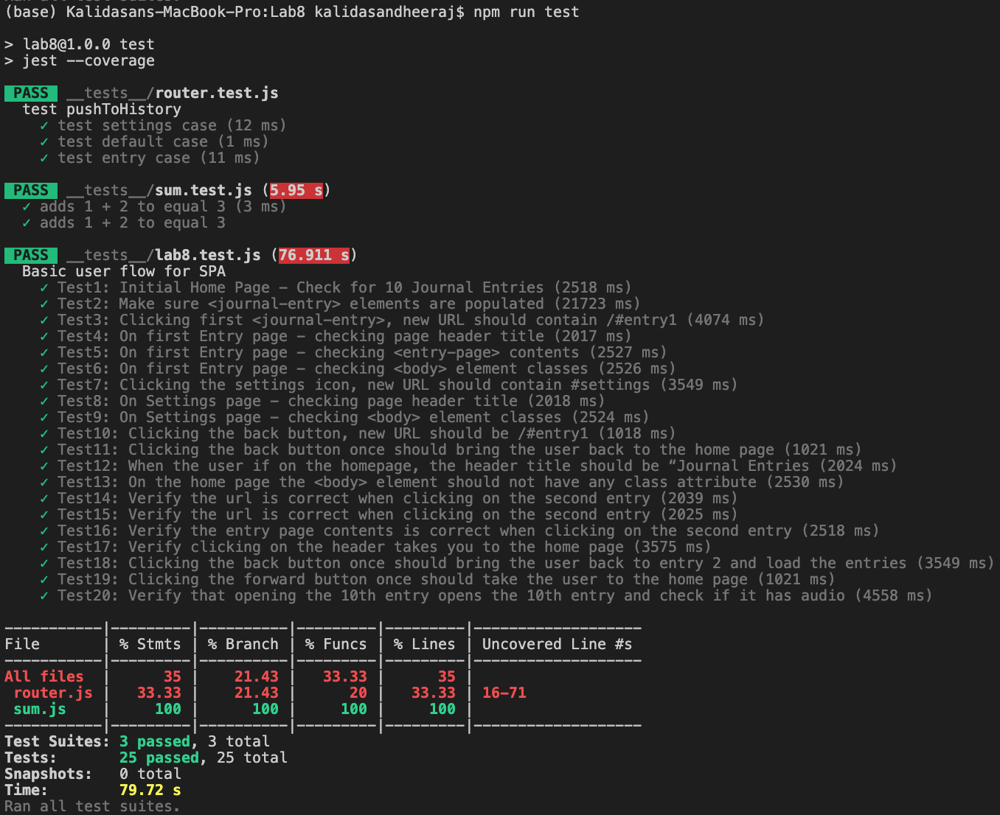

# Lab8_Starter

## Author(s):
- Gaurav Dheeraj Kaliaperumal Kalidasan
- Joseph Christopher Priyanto

## Check your understanding q's (FILL OUT)
1. In your own words: Where would you fit your automated tests in your Bujo project development pipeline? (just write the letter)

Ans. 1

2. Would you use a unit test to test the “message” feature of a messaging application? Why or why not? For this question, assume the “message” feature allows a user to write and send a message to another user.

Ans. No, we would not use a unit test for this because we can only test individual components, and this "message" feature involves a combination of number of moving parts. E2E tests can be rather done to test this feature.

3. Would you use a unit test to test the “max message length” feature of a messaging application? Why or why not? For this question, assume the “max message length” feature prevents the user from typing more than 80 characters

Ans. Yes, because this is a simple component that is implemented in a messaging application. We can easily test this by inputting a message that has more than 80 characters and checking for its intended behaviour.

4. What do you expect to happen if we run our puppeteer tests with the field “headless” set to true?

Ans. When 'headless' is set to true, a browser does not pop up to perform the tests. It runs the tests without a browser UI. Contrarily, if 'headless' is set to false, a Chromium browser pops up to perform the tests in it.

5. What would your beforeAll callback look like if you wanted to start from the settings page before every test case?

```
beforeAll(async () => {
  await page.goto('http://127.0.0.1:5500');
  await page.click('header img')
  await page.waitForTimeout(500);
});
```

## Screenshot of All Tests Running


